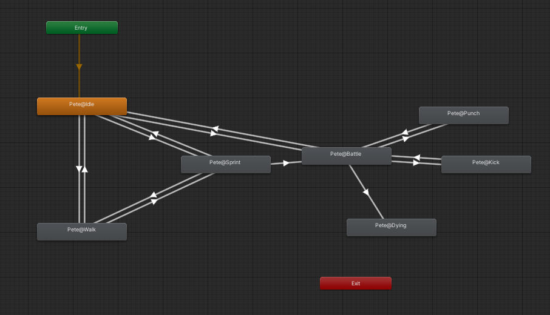

## 📜 프로젝트 소개

- Survival And Escape는 **전쟁 피란민 체험 생존 VR 시뮬레이션 게임**입니다. 
- 플레이어는 암울한 전쟁 속에서 생존을 위해 발버둥치며 전쟁의 참혹함을 경험하게 됩니다.
- 현재 데모 버전까지 개발이 진행되었습니다.
- 개발 기간 : 2022.04.11 - 2022.05.20 (6주)
- 개발 인원 : 6명 

## 🤸🏿 역할
- 이호형: 팀장, 캐릭터 스테이터스, 수리 오브젝트 개발
- 김하영: 인벤토리 시스템 개발
- 나지엽: 멀티 플레이어, 게임 매니징
- 박홍규: 플레이어 특성 선택
- 이진행: 맵 디자인, 애니메이션 제작
- 임영택: Oculus VR과 연결, 적대 NPC 상호작용

## 📚 기술 스택
- Unity VR/AR
- Meta Quest
- Jira, PlasticSCM, git
- Photon

## 🏆 수상
**삼성 청년 SW 아카데미(SSAFY) 자율프로젝트 우수상 수상**

## 🎞️ 오프닝 및 트레일러 영상
- [YouTube 링크](https://youtu.be/OvFk1tkkb2g)

## ⬇️ 다운로드 링크
- [파일 다운로드](https://drive.google.com/u/0/uc?id=1H5MRSkSr83BIc9R4iGFYcqYOnHeQZ3I6&export=download)
- `Unity_Build/ssafy_proj.exe`를 통해 실행 가능합니다. <- 가능하면 이름 바꿔서 재빌드하면 좋을 것 같습니다.
- Github 코드의 `Asset/07. Resource` 폴더 내의 모든 내용은 용량 문제로 인해 구글 드라이브에 보관되어 있으며 [링크](https://drive.google.com/u/0/uc?id=1H5MRSkSr83BIc9R4iGFYcqYOnHeQZ3I6&export=download)를 통해 다운받을 수 있습니다.

## 📏 게임 룰
- 플레이어는 전쟁의 위협을 피해 버려진 집에 숨었습니다. 
- 플레이어는 낮과 밤을 반복하면서 생존을 도모합니다.
  - 낮에는 전쟁으로 인해 외부 활동이 불가능합니다.
  - 낮
    - 아이템을 사용하여 스테이터스를 관리합니다.
    - 집 내에서 수리할 수 있는 오브젝트를 아이템을 사용하여 수리할 수 있습니다. 수리된 오브젝트는 생존에 유리한 다양한 기능을 보유하게 됩니다.
  - 밤
    - 맵에 인벤토리를 보유하고 있는 오브젝트들이 배치되어 있으며, 이를 통해 아이템을 획득할 수 있습니다.
    - 적대적인 NPC들이 배치되어 있습니다. 이들에게 공격받을 수 있으며, 은닉 기능을 이용하여 NPC들의 추적을 따돌릴 수 있습니다.
- 플레이어의 목표는 생존 혹은 탈출입니다. 
- 특정 기간 생존하면 생존 엔딩을 마주할 수 있으며, 탈출에 필요한 아이템들 모아 은신처 맵에 배치된 자동차 오브젝트를 수리하면 탈출 엔딩을 마주할 수 있습니다.

## ⭐ 핵심 기능
플레이어로서 주목할 수 있는 핵심 기능은 다음과 같습니다.

1. 직접 제작된 맵
2. 다양한 오브젝트에 저장되는 인벤토리 시스템
3. 직접 구현된 NPC 모션과 적대적 기능
4. 아이템을 사용하여 오브젝트를 수리할 때 개방되는 추가적인 기능
5. 랜덤 이벤트

## 🖥 개발 내용
- 맵
  - 상황 설정에 맞춰 직접 제작하였습니다.
    - 아이템을 소모하여 생존을 도모하는 낮 맵
      - 피난처 내부에서 진행됩니다.
      
        
    - 적 NPC를 회피하고 아이템을 획득하기 위한 밤 맵
      - 곳곳에 아이템과 적 NPC가 배치되어 있는 야외에서 진행됩니다.
      
            
- 스테이터스
  - 스테이터스는 아이템 사용, 수리 행동, 랜덤 이벤트 등 다양한 상황에 따라 변합니다.
  - 플레이어는 손목 쪽에서 스테이터스를 확인할 수 있습니다.
      
    

- 인벤토리
  - 오브젝트별로 각기 다른 인벤토리 존재합니다.
  - 아이템 정보는 자동 저장, 불러오기 됩니다.
  - 인벤토리간 아이템을 옮길 수 있습니다.
  - Scriptable object를 이용해 효율적으로 관리할 수 있습니다.
  
  

- NPC
  - 전쟁 상황에 적합한 공격적인 약탈자 NPC를 설계하였습니다.
  - 약탈자의 공격성을 표현하기 위한 공격적인 모션을 직접 제작하였습니다.
      
    
      
  - 플레이어는 적대적인 NPC에게 추격당하거나 공격당하고, 은신을 통해 도주할 수 있습니다.
    - 추격
          
      
          
    - 공격
          
      
          
    - 은신
          
      
            
- 수리
  - 아이템을 사용하여 오브젝트를 수리할 수 있습니다.
  - 수리 정보는 자동 저장, 불러오기 됩니다.
  - 수리하는 경우 오브젝트마다 각각의 추가적인 기능이 개방됩니다.
    - 라디오 수리시 생존에 도움이 되는 정보를 획득 가능합니다.
        
      
          
    - 욕조 수리시 아이템이 들어있는 추가적인 인벤토리 개방됩니다.
        
      
            
- 랜덤 이벤트
  - 하루가 종료될 시 랜덤 이벤트가 발생합니다.
  - 랜덤 이벤트는 캐릭터나 기타 환경에 따라 발생 확률이 달라질 수 있으며, 캐릭터 스테이터스나 인벤토리 등 게임 플레이에 직접적인 영향을 미칠 수 있습니다.
    
  
            
## ❓ 개발 방식
- 맵
  - 에셋을 바탕으로, 플레이어에게 **몰입감**을 주는 것에 집중하여 맵을 직접 설계하였습니다.
  - VR경험을 극대화 할 수 있도록 다양한 장치들을 구현하였습니다. (ex. 옥상에서 다리 건너기, 다양한 조명효과 등)
  - 오브젝트 뿐만 아니라 사운드 효과, 포스트 프로세싱 효과 등 모든 부분이 게임 내 상황 설정에 따라 플레이어에게 몰입할 수 있게 하였습니다.
  
- 스테이터스
  - 스테이터스는 캐릭터에 적용되는 요소입니다. 하지만 캐릭터는 플레이어뿐만 아니라 NPC도 존재합니다. **확장성**을 위해서는 NPC에도 플레이어와는 조금 다른 요소를 가진 스테이터스가 적용될 수 있어야 했습니다. 또한 한 명의 NPC에는 하나의 스테이터스가 필요했으므로, 추가와 삭제가 용이해야 했습니다. 이를 위해 **scriptable object**와 **상속 구조**를 이용하여 다양한 종류의 NPC에 대해 동일한 방식으로 적용되며 쉽게 추가할 수 있는 구조를 구축하였습니다.
  - 스테이터스는 외부 요소에 따라 그 값이 쉽게 변할 수 있어야 하며, 그 값에 따라 외부 요소를 변경할 수도 있어야 합니다. 예를 들어 음식을 먹으면 굶주림이 해소되거나, 체력이 낮은 경우 시야가 흐릿해지는 등 **외부 요소와 쉽게 상호작용**할 수 있어야 합니다. 그러면서도 쉽게 관리하기 위해 스테이터스의 변경과 관리는 모두 하나의 스크립트 안에서 처리될 수 있도록 하였으며 각각의 기능을 **메소드로 세분화**하여 외부에서 쉽게 접근할 수 있도록 하였습니다. 이를 통해  여러 함수를 조합하여 상황에 따라 각기 다른 처리를 할 수 있도록 하였습니다.
- 인벤토리
  - 수리와 마찬가지로 **sriptable object**를 이용하여 각기 다른 다수의 인벤토리가 존재하며, 하나의 패널이 각기 다른 인벤토리에 동일하게 작동할 수 있도록 설계되었습니다.
  - 인벤토리의 한 칸 한 칸마다 클릭, 드래그, 엔터 등 다양한 **이벤트**를 적용하여 생성합니다.
  - 아이템에 일괄적으로 관리할 수 있도록 하나의 scriptable object로 **아이템** **데이터베이스**가 존재하며, 이를 통해 아이템을 쉽고 일관되게 관리할 수 있습니다.
- NPC
  - Animation
    - 에셋 NPC를 Adobe사의 Mixamo를 이용하여 애니메이션을 적용하고, 이를 스크립트를 이용하여 호출하였습니다.
    - 대기, 걷기, 달리기, 전투, 주먹질, 발차기, 기절. 총 7가지 상태를 구현하였습니다.
    
  - Ai
    - 게임 내 상황 설정에 따라 몰입감을 주기 위해 적대적인 NPC의 공격적인 모션을 직접 **제작**하였습니다.
    - 추격 범위가 지정되어 있으며 플레이어가 벗어날 시 마지막으로 확인된 장소로 추격합니다. 플레이어가 은신한 경우 초기 장소로 돌아갑니다.
    - NPC가 이동할 수 있는 경로를 Bake하여, 복층 구조에서도 플레이어를 추적하고, 복귀할 수 있도록 하였습니다.
- 수리
  - 수리가 가능한 오브젝트들은 모두 수리 기능을 포함하고 있어야 하나, **서로 다른 수리 설정값을 보유**해야 하며, **수리 이후에는 서로 다른 기능을 보유**하고 있어야 합니다. 이를 위해 수리 기능을 하나의 **scriptable object**로 작성하여 수리 가능한 오브젝트마다 자동으로 생성 후 부착해주었고, 이를 통해 같은 수리 기능을 공유하면서도 서로 다른 기능과 설정을 보유할 수 있게 하였습니다.
  - 수리 패널은 **하나의 패널**이 모든 수리 가능한 오브젝트에 **동일하게 작동**해야 합니다. 따라서 수리 패널을 수리 기능과 연결하는 방식이 문제가 되었습니다. 초기에는 코루틴을 통하여 패널과 수리 기능을 연결하는 방식을 선택했으나, 이 경우 수리 패널의 동기화가 육안으로 확인이 가능할 정도로 **지연**되는 현상이 존재했습니다. 따라서 이를 코루틴을 이용한 방식을 **폐기**하고 필요한 경우 패널을 생성하고 파괴하는 방식을 도입하여 지연 없이 패널을 작동시킬 수 있었습니다.
  - 수리 기능은 아이템을 조회하고 사용한다는 측면에서 인벤토리 기능과의 **협업**이 요구되었습니다. 따라서 구현된 인벤토리 기능을 먼저 학습하는 것으로 시작하여 수시로 **소통**을 진행하였고, 이로 인해 기존 인벤토리의 구조와 충돌하지 않는 방식으로 수리 기능을 구현할 수 있었습니다.
- 랜덤 이벤트
  - 스테이터스와 마찬가지로 **외부 요소와 쉽게 상호작용**할 수 있게 하였으며, 랜덤 이벤트 관련 관리는 모두 하나의 스크립트 안에서 처리될 수 있도록 하였습니다.

## ✏️ 개발 과정
- [기능명세서](https://docs.google.com/spreadsheets/d/11nbCywE9-ItugImtgOqRK3TjIz1MZ11mqXiZ_a4V0Cc/edit?usp=sharing)
- [UI 디자인](https://app.tryeraser.com/workspace/gather:lSV8aQlSZzgRzXGgtable9)
- [데일리 스크럼](https://www.notion.so/fcab52cd437e4ff194d4375b05a14d38)
- [Jira, PlasticSCM, Git](https://www.notion.so/Jira-PlasticSCM-Git-8648df3bfe0e4c4682eeb594c09342b2)

## 💡 개발 후기
- 이호형: 열정적인 팀원 분들 덕분에 짧은 기간 안에 많이 배울 수 있었습니다. 감사합니다!
- 김하영:
- 나지엽:
- 박홍규:
- 이진행: Unity를 이용한 개발을 처음 진행하면서 다양한 어려움들이 있었지만, 팀원들의 협력으로 잘 해결해나갈 수 있었습니다. 게임 외적인 디자인적인 부분을 많이 담당하게 되었는데 재미있는 경험이였습니다.
- 임영택:

